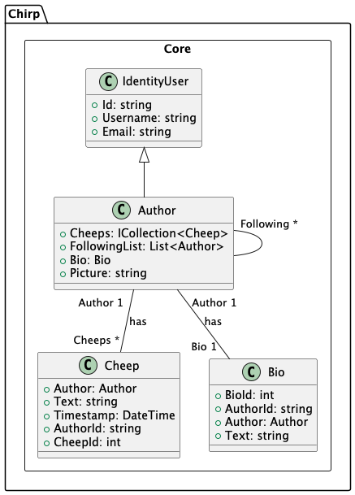
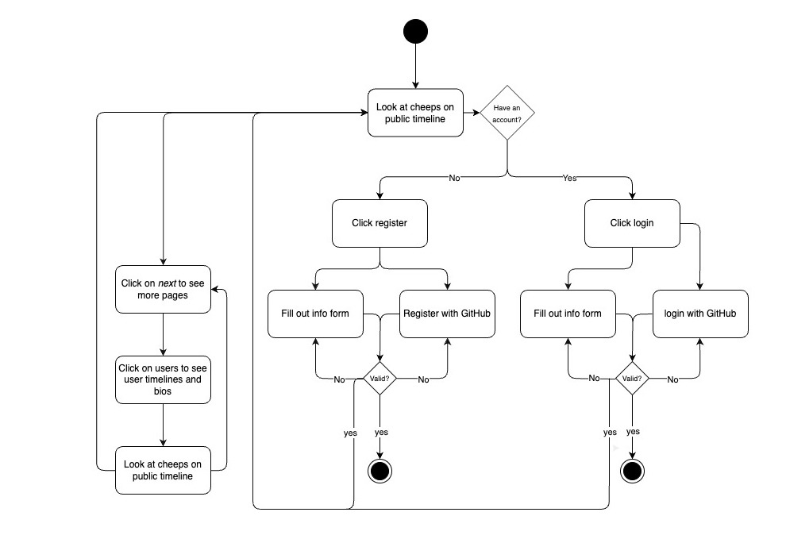
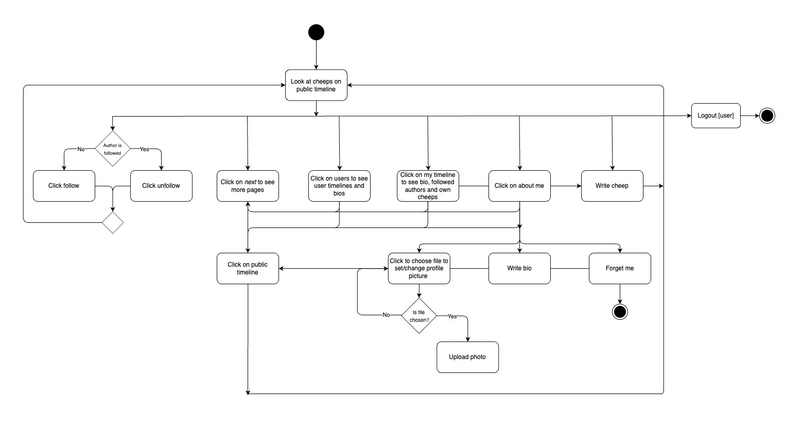
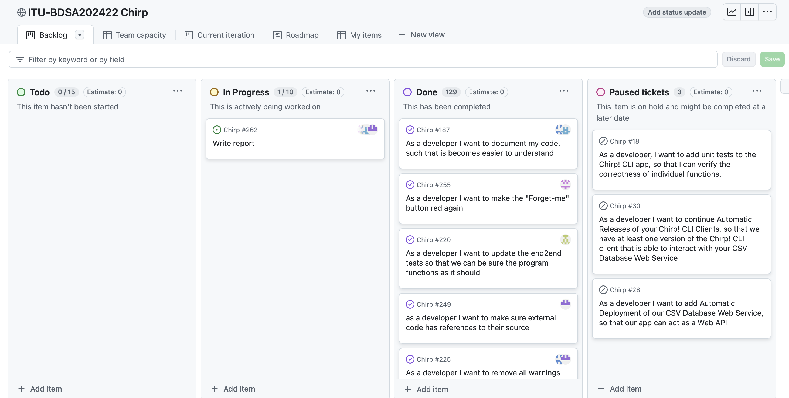
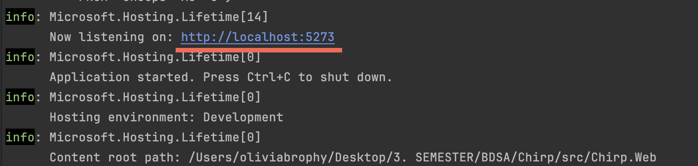
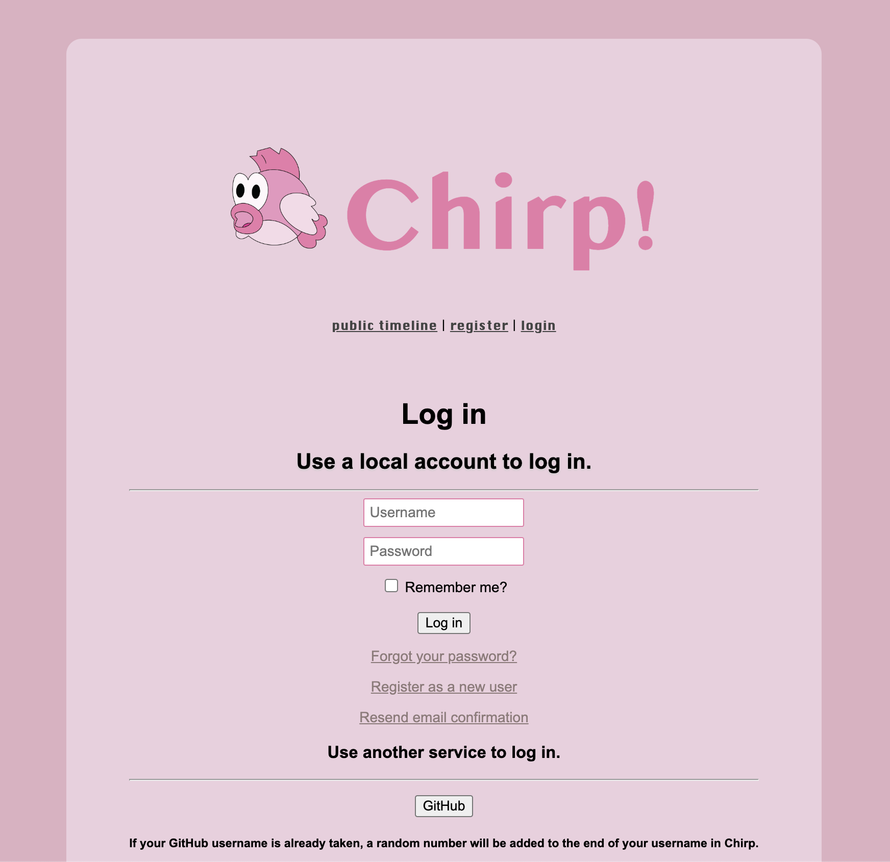

# Design and Architecture of _Chirp!_

## Domain model

Here comes a description of our domain model.

<How to indsætte billede:>
_Figure ##: An overview of the domain model_

An illustration of the domain model is seen in the UML-diagram above. It depicts the relations and cardinalities between the entities.


## Architecture — In the small
_Figure##: Layers of our architecture_

Figure## demonstrates our use of the Onion Architecture pattern in our implementation. Each layer is shown as a nuance of grey, where the different classes, interfaces and packages are shown, each belonging to a layer in our program. Here, the dependencies are shown with arrows, highlighting how the arrows are pointing inwards across the layers, living up to the criteria of the Onion Architecture pattern. The figure illustrates how the dependencies do not flow outward, and how the inner layers have no knowledge of the outer layers.

## Architecture of deployed application

## User activities
Chirp is a relatively simple program to navigate through. To illustrate the primary functions of a typical user journey, we have created activity diagrams for authorised/unauthorised users.

_Figure##: activity diagram for unauthorised users_

Figure## illustrates the flow for unauthorised users interacting with Chirp. Users can browse the public timeline, view more pages, go to other users timelines, or navigate to registration/login options. If a user has no account, they can click register and proceed either by filling out the registration form or using GitHub for registration. Both paths require validation. If the user already has an account, they can click login via username or GitHub login. Once the user successfully registers or logs in, they are directed to the system's authorised user area.

_Figure##: activity diagram for authorised users_

Figure## illustrates the flow of actions for an authorised user, starting with viewing cheeps on the public timeline. Users can follow or unfollow authors, navigate to other pages, or view user timelines and bios, depending on their preferences. By accessing "my timeline", users can see their bio, their authored cheeps, and followed authors’ cheeps. Authorised users can update their profiles by choosing a file to upload a profile picture, writing a bio, or clicking "Forget me" to delete their account. Users have the option to write new cheeps, interact with personalised or general public content, and log out, completing the interaction cycle.

## Sequence of functionality/calls through _Chirp!_

_Figure##: Sequence diagram for an unauthorized user_
The sequence diagram above, figure##, demonstrate the sequence of an unauthorised user accessing our Chirp application. Here the user’s request goes through the layers of our implementation, where a list of the 32 newest cheeps are retrieved from the database and returned to the user on the webpage.
Below is a sequence diagram of a user logging in on our application and afterwards posting a cheep to the timeline. The request to log in with Github is forwarded to OAuth where the login is handled. The request will return as a success and the user will be redirected to the public timeline. Here the now authenticated user can post a cheep which will be stored in the database and shown on the public timeline.


_Figure##: Sequence diagram for authenticated user posting a cheep_


# Process

## Build, test, release, and deployment

### Building and testing


Figure ##: Illustration of the building and testing workflow

When a pull-request or a push is made to the main branch in GitHub, a workflow verifying that building and testing the application still runs.The tests running are the tests in Chirp.Tests where both repositories, CheepRepository and FollowRepository, and their functionalities are tested.

### Releasing to GitHub and deploying application


When a tag is pushed to GitHub the building and testing workflow will run as described earlier. If the build and test succeeds there will be created a new release with the given tag number and the application will be built in files for Windows, Linux, MacOS, and MacOS-arm. After ending this flow the next flow starts running - the deployment flow. Here the program is once again built and all the necessary files for publishing the application are collected in a new directory (an artifact) and uploaded to GitHub to make it available for deployment. The artifact is downloaded and the ready-for-publish files are now available for Azure to deploy the application. This marks the end of the lines of flows.


## Team work
Below is an image of our project board right before hand-in. Here, almost all of our tasks are resolved and live up to their respective acceptance criteria. We have some paused tickets regarding Chirp CLI that we did not have time to resolve before we switched to Razor Pages and they therefore got placed in “Paused tickets” in case we had time to resolve them later. We managed to fulfill the requirements set throughout the course and the ones that we set ourselves. One part of our program that we would have liked to work more on if we had the time, would be adding more tests, although we believe that our tests still cover most of our program.
_Figure##: Our project board_
During the course we tried our best to constantly update our project board and continuously write new tickets after each lecture. We then delegated the tickets among the group members and started working on the issue and during the last stretch of the course, we started assigning specific group members to tickets. We worked in many different constellations throughout the project, both doing pair, mob and individual programming depending on the extent of the issue. Figure## shows the workflow for each issue starting with creating a new branch and ending with deleting it, to keep the number of active branches at a minimum.
_Figure##: Activity diagram showing work progress for an issue_
## How to make _Chirp!_ work locally
To run the system, follow these steps.

**Step 0: Ensure you have the correct softwares downloaded**

Software needed:

Rider or Visual Studio Code

.NET 8.0

If you don’t have .NET 8.0 installed, run the following command.
```
brew install dotnet@8
```


### **Step 1: Cloning the project**

Navigate to the Github repository page for Group 8:

https://github.com/ITU-BDSA2024-GROUP22/Chirp

Press on the green button '<> Code' and copy the HTTPS address

Navigate to the folder where you want to clone the repository:

```
cd path/to/your/folder
```
Use the copied repository URL:

```
git clone <repository-url>
```
### **Step 2: Open project**

Open in Rider or Visual Studio Code

Navigate to Chirp.web

```
cd src/Chirp.Web
```


### **Step 3: set user secrets**

Run these two commands to set the user secrets

```
dotnet user-secrets set "authentication_github_clientId" "Ov23liZYXvXPxOxqjMap" dotnet user-secrets set "authentication_github_clientSecret" "ab07248b11a19096e2c822b96605679072c02f74"
```

### **Step 4: run the program on localhost**

```
dotnet run
```

Click on the URL and you will be directed to the web application.



Be aware that when logging in, it needs your username and not e-mail.



To shut down the application, press Ctrl+C in the local terminal.
## How to run test suite locally
To run test cases from the root of the Chirp Application. Run the following commands:


```
cd test/Chirp.Tests
```
```
dotnet test
```

The CheepRepositoryTest class tests various methods of the CheepRepository for managing authors and cheeps, including creating authors, retrieving cheeps, updating bios, and deleting authors. It covers scenarios like empty repositories, pagination, non-existent authors, and updating bio details.

The FollowRepositoryTest class tests the functionality of following, unfollowing, and retrieving Cheeps from followed users. It covers scenarios like pagination, handling non-existent users, and preventing duplicate follows.

The tests are set up to verify Chirp application's functionality using an in-memory database, where user profiles, timelines, and Cheeps are created and retrieved. Each test ensures that the relevant data is displayed correctly on the user's profile and timeline. Additionally, tests for bio sections and "About Me" pages are included to ensure correct display of user information.


# Ethics

## License
This software is licensed under the MIT license. The MIT license is an open source and permissive license that allows other users to modify, use and distribute the software, just needing the original license to be included. The license has been chosen to make the code freely accessible to other users and therefore encourages collaborations across developers and companies while maintaining minimal restrictions.

## LLMs, ChatGPT, CoPilot, and others
During this project, we used ChatGPT to support our development. We were mindful about how we used it and tried to avoid using it for writing concrete code. Instead we used it for helping us find bugs sometimes, since we are not used to debugging in a program that is not only running locally like our previous semesters.
We also used it to find out where would be a good place to start when a week’s requirements were more open-ended. Sometimes we also used it for specific code examples, primarily during testing, since we were also introduced to new ways of testing during this course. We found these uses of LLM’s very helpful and they definitely sped up our development, especially in instances where we were very stuck.
