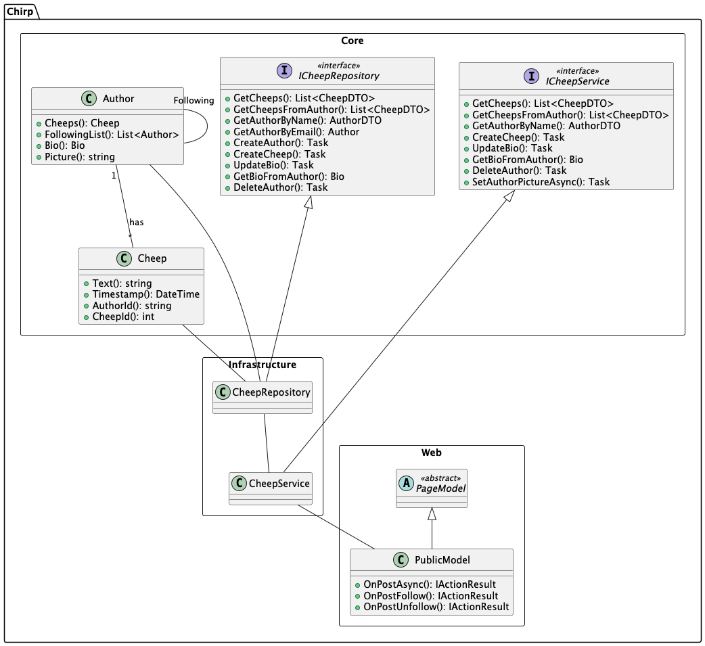
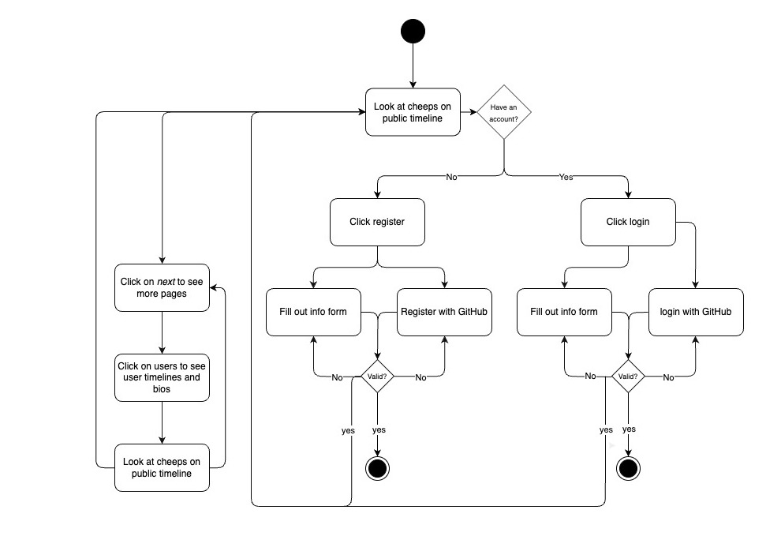
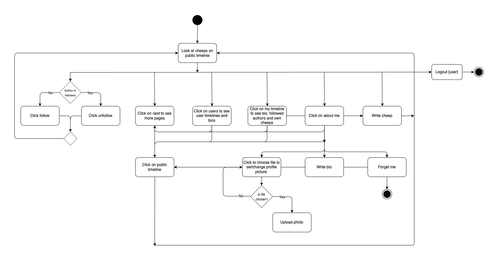

# Design and Architecture of _Chirp!_

## Domain model

Here comes a description of our domain model.

<How to indsætte billede:>
_Figure ##: An overview of the domain model_

An illustration of the domain model is seen in the UML-diagram above. It depicts the relations and cardinalities between classes and interfaces. It’s only a part of the program shown in the diagram. This is to show how the program is built while functioning as a representation of how the remaining classes and interfaces are related. For example, the repository FollowRepository inherits from an interface called IFollowRepository while also having a relation to FollowService. CheepService simultaneously has a relation to a UserTimelineModel and an AboutMeModel.

## Architecture — In the small
_Figure##: Layers of our architecture_

Figure## demonstrates our use of the Onion Architecture pattern in our implementation. Each layer is shown as a nuance of grey, where the different classes, interfaces and packages are shown, each belonging to a layer in our program. Here, the dependencies are shown with arrows, highlighting how the arrows are pointing inwards across the layers, living up to the criteria of the Onion Architecture pattern. The figure illustrates how the dependencies do not flow outward, and how the inner layers have no knowledge of the outer layers.

## Architecture of deployed application

## User activities
Chirp is a relatively simple program to navigate through. To illustrate the primary functions of a typical user journey, we have created activity diagrams for authorised/unauthorised users.

_Figure##: activity diagram for unauthorised users_

Figure## illustrates the flow for unauthorised users interacting with Chirp. Users can browse the public timeline, view more pages, go to other users timelines, or navigate to registration/login options. If a user has no account, they can click register and proceed either by filling out the registration form or using GitHub for registration. Both paths require validation. If the user already has an account, they can click login via username or GitHub login. Once the user successfully registers or logs in, they are directed to the system's authorised user area.

_Figure##: activity diagram for authorised users_

Figure## illustrates the flow of actions for an authorised user, starting with viewing cheeps on the public timeline. Users can follow or unfollow authors, navigate to other pages, or view user timelines and bios, depending on their preferences. By accessing "my timeline", users can see their bio, their authored cheeps, and followed authors’ cheeps. Authorised users can update their profiles by choosing a file to upload a profile picture, writing a bio, or clicking "Forget me" to delete their account. Users have the option to write new cheeps, interact with personalised or general public content, and log out, completing the interaction cycle.

## Sequence of functionality/calls trough _Chirp!_

# Process

## Build, test, release, and deployment

## Team work

## How to make _Chirp!_ work locally

## How to run test suite locally

# Ethics

## License

## LLMs, ChatGPT, CoPilot, and others
